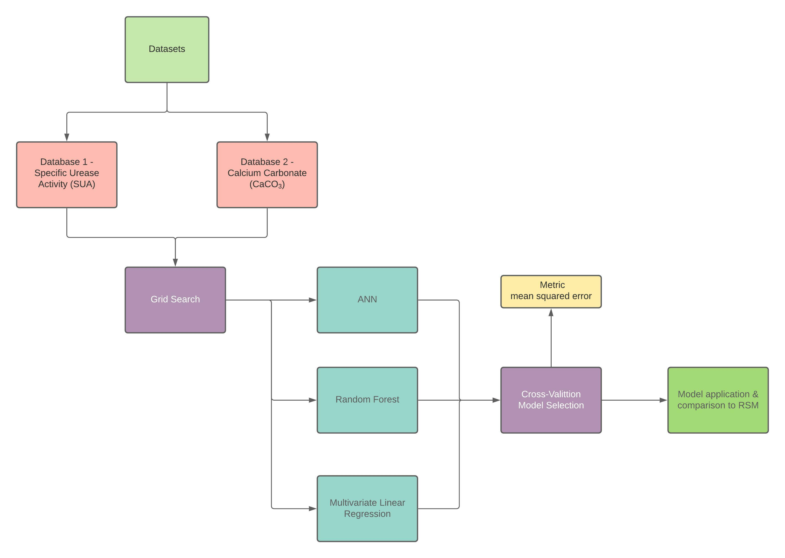

# RandomForest-ANN-RSM
This repository is a study, also related to my doctoral thesis.

The purpose of the article is to compare the traditional method of the Response Surface Method (RSM), with alternative methodologies that involve Artificial Intelligence in the prediction and creation of models

In it, the two main Machine Learning methodologies are applied: Random Forest Regressor and Artificial Neural Networks. And also the Multivariate Linear Regression methodology (scikit-learn).

## Datasets
The datasets used for the study come from the authors: Okyay and Rodrigues (2014) and Kahani et al. (2020)

References: 

Okyay, T.O., Rodrigues, D.F., 2014. Optimized carbonate micro-particle production by Sporosarcina pasteurii using response surface methodology. Ecological Engineering 62, 168–174. https://doi.org/10.1016/j.ecoleng.2013.10.024

Rodríguez, J.D., Pérez, A., Lozano, J.A., 2010. Sensitivity Analysis of k-Fold Cross Validation in Prediction Error Estimation. IEEE Transactions on Pattern Analysis and Machine Intelligence 32, 569–575. https://doi.org/10.1109/TPAMI.2009.187

## Methodology
The methodological basis of the article was to apply Artificial Neural Network, Random forest Regressor and Multivariate Linear Regression in comparison with the Response Surface Method.

For this, the correlation analysis of the variables were explored, as well as the optimization of the parameters of each model via Grid-Search and Cross-Validation.

The fluxogram is shown below: 

 

And, the architecture of a general ANN for the study is also shown below:

 

## Note
This repository is an alternative approach to a repository already mentioned within the profile, under the name: Machine-Learning-ANNs-applied-to-Geotechnical-issues.

It is an improvement and evolution of the study, which does not discard the techniques used in the first one, but they are different to the point of being parallel studies.
